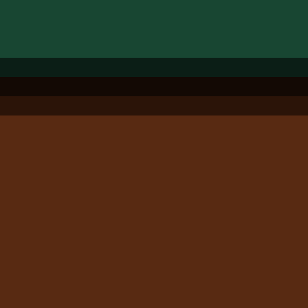
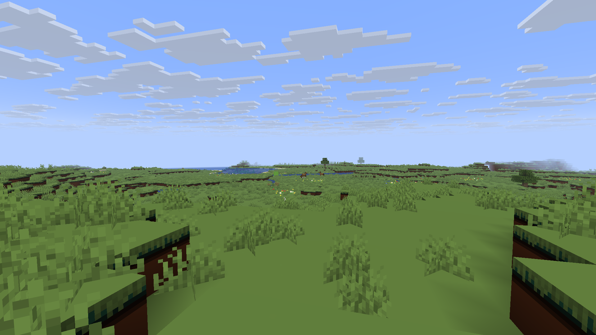
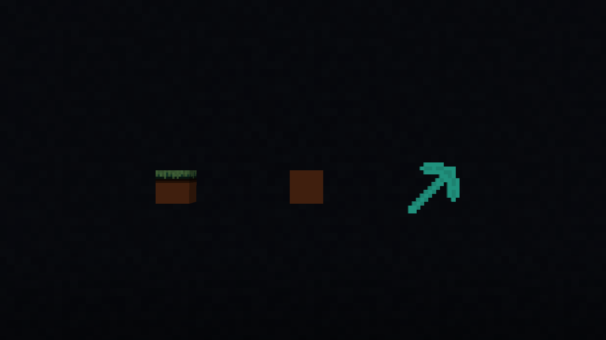

# LEGO Minecraft
LEGO Minecraft updates EVERY texture in Java Edition to look like LEGO!

[Releases](https://github.com/ChargeUp03/LEGO-Minecraft/releases/tag/Beta) | Modrinth

> [!WARNING]
> This resource pack is currently in beta. Anything you see is subject to change.

_An image of grassy hills with the LEGO Minecraft resource pack._

## Overview

LEGO Minecraft aims to make every single texture in the game like their LEGO counterparts. That means every block, tool, item, mob, and even debug blocks. They will try to match their LEGO versions as closely as possible. Some blocks and items were not created in LEGO form yet, so creative liberties will be taken to create these, basing them off similar exisitng items.

_From left to right: grass block, dirt block, diamond pickaxe._

## Installation

[Minecraft: Java Edition](#minecraft-java-edition) | [Minecraft: Bedrock Edition](#minecraft-bedrock-edition)

### Minecraft: Java Edition
1. Download `LEGO Minecraft.zip` from [Releases](https://github.com/ChargeUp03/LEGO-Minecraft/releases/tag/Beta)
2. Open Minecraft Java, then go to Options --> Resource Packs --> Open Pack Folder --> Drop `LEGO Minecraft.zip` in the folder.
3. Click the arrow on the icon to move it to Active
4. Click 'Done'

### Minecraft: Bedrock Edition
Coming soon!

## Compatibility
This resource pack is compatible with Minecraft Java 1.21.6-1.21.11

## Updates
- [Current] v0.1 Beta (3.32.2026)
